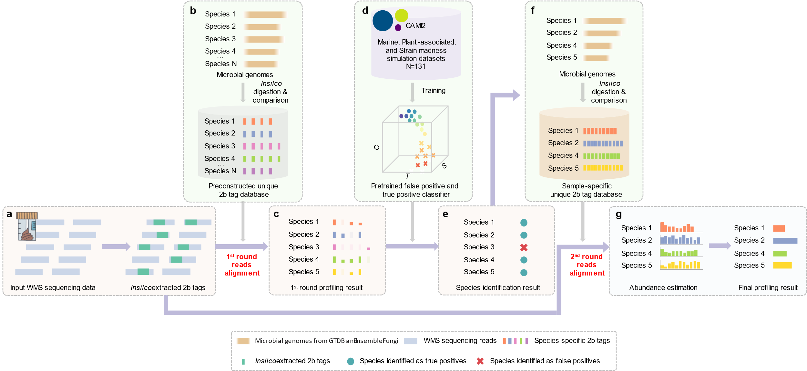

# MAP2B

----------------------------
**M**et**A**genomic **P**rofiler based on type **IIB** restriction site

### Why do I need to run MAP2B?
Accurate species identification and abundance estimation are critical for the interpretation of whole metagenome sequencing (WMS) data. Numerous computational methods, broadly referred to as metagenomic profilers, have been developed to identify species in microbiome samples by classification of sequencing reads and quantification of their relative abundances. Yet, existing metagenomic profilers typically suffer from false-positive identifications and consequently biased relative abundance estimation. Indeed, false positives can be accounted for more than 90% of total identified species. Here, we present a new metagenomic profiler MAP2B to resolve those issues. 

For more details, please see [Eliminate false positives in metagenomic profiling based on type IIB restriction sites](https://www.nature.com/articles/s41467-023-41099-8#citeas).

## The workflow of MAP2B
Instead of directly estimating the relative abundances of the species through aligning reads against the whole microbial genome or marker genes as existing metagenomic profilers do, we use the following two-round reads alignment strategy:

(**A**) For any input WMS data, 2b tags can be extracted by 2B in silico digestion.   
(**B**) WMS-originated 2b tags will be mapped against a preconstructed unique 2b tag database, which contains ~50,000 identifiable species.  
(**C**) In the 1st round of reads alignment, genome coverage, taxonomic count, sequence count and G score are calculated for each species.  
(**D**) The four features above will be passed into a preconstructed false positive recognition model.  
(**E**) A high-precision species identification result will be generated.  
(**F**) A sample-dependent unique 2b tag database will be constructed based on the species identification result.  
(**G**) In the second round of reads alignment, we estimate [taxonomic abundance](https://www.nature.com/articles/s41592-021-01141-3) for each species.  

 
 
## Installation
 
 ### System requirements
 
 #### Dependencies
All scripts in MAP2B are programmed by Perl and Python, and execution of MAP2B is recommended in a conda environment. This program could work properly in the Unix systems, or Mac OSX, as all required packages can be appropreiately download and installed.  
 #### Memory usage
**> 14G RAM** is required to run this pipeline.  
 ### Download the pipeline
 * Clone the latest version from GitHub (recommended):  
 
   `git clone https://github.com/sunzhengCDNM/MAP2B/`  
   `cd MAP2B`
   
    This makes it easy to update the software in the future using `git pull` as bugs are fixed and features are added.
 * Alternatively, directly download the whole GitHub repo without installing GitHub:
 
   `wget https://github.com/sunzhengCDNM/MAP2B/archive/master.zip`  
   `unzip master.zip`  
   `cd MAP2B-master`
   
 ### Install MAP2B in a conda environment 
 * Conda installation  
   [Miniconda](https://docs.conda.io/en/latest/miniconda.html) provides the conda environment and package manager, and is the recommended way to install MAP2B. 
 * Create a conda environment for MAP2B pipeline:  
   After installing Miniconda and opening a new terminal, make sure you’re running the latest version of conda:
   
   `conda update conda`
   
   Once you have conda installed, create a conda environment with the yml file `config/MAP2B-20230420-conda.yml`.
   
   `conda env create -n MAP2B.1.5 --file config/MAP2B-20230420-conda.yml`
   
 * Activate the MAP2B conda environment by running the following command:
 
   `conda activate MAP2B.1.5` or `source activate MAP2B.1.5`
   
   Make sure the conda environment of MAP2B has been activated by running the above command before you run MAP2B everytime.  

 * The workflow begins by checking the database's existence, and if it is not found, the corresponding database will be downloaded automatically to the software installation path. This download process may take some time, but it ensures that the necessary databases are readily available for the workflow. Alternatively, you can also download the GTDB database and RefSeq database independently using the following commands:
 
   * for GTDB database
 
      `python3 scripts/DownloadDB.py -l config/GTDB.CjePI.database.list -d database/GTDB`
	   
   * for RefSeq database
	 
      `python3 scripts/DownloadDB.py -l config/RefSeq.CjePI.database.list -d database/RefSeq`
    
   Now, everything is ready for MAP2B :), Let's get started.
 
## Using MAP2B
 
### Quick start
MAP2B is a highly automatic pipeline, and only a few parameters are required for the pipeline.
* We prepared a real pair-end sequencing data of a MOCK community:  
 
   `cd example`  
   `mkdir -p data/`  
   `wget -t 0 -O data/shotgun_MSA-1002_1.fq.gz https://figshare.com/ndownloader/files/38346149/shotgun_MSA-1002_1.fq.gz`  
   `wget -t 0 -O data/shotgun_MSA-1002_2.fq.gz https://figshare.com/ndownloader/files/38346155/shotgun_MSA-1002_2.fq.gz`  
 
* After downloading the sequencing data, we can finally run MAP2B:  
 
   `python3 ../bin/MAP2B.py -i data.list`

    In `data.list` you can learn how to prepare your input data, both single-end and paired-end data can be used as input.  
    
```
sample1 <tab> shotgun1_left.fastq(.gz) <tab> shotgun1_right.fastq(.gz)
sample2 <tab> shotgun2.fastq(.gz)
sample3 ...
```

### Parameters
The main program is `bin/MAP2B.py` in this repo. You can check out the usage by printing the help information via `python3 bin/MAP2B.py -h`.

```
usage: MAP2B.py [-h] -i INPUT [-o OUTPUT] [-d DATABASE] [-p PROCESSES]
                [-g GSCORE]

optional arguments:
  -h, --help    show this help message and exit
  -i INPUT      The filepath of the sample list. Each line includes an input sample ID and the file path of corresponding DNA sequence data where each field should be separated by <tab>. The line in this file that begins with # will be ignored. 
                  sample <tab> shotgun.1.fq(.gz) (<tab> shotgun.2.fq.gz)
  -o OUTPUT     Output directory, default ./MAP2B_result
  -s {GTDB,RefSeq}  Data source, choose from GTDB or RefSeq, default GTDB
  -d DATABASE   Database path for MAP2B pipeline, MAP2B_path/database
  -p PROCESSES  Number of processes, note that more threads may require more memory, default 1
  -g GSCORE     Using G score as the threshold for species identification, -g 5 is recommended. Enabling G score will automatically shutdown false positive recognition model, default none

author: Liu Jiang, Zheng Sun
mail: jiang.liu@oebiotech.com, spzsu@channing.harvard.edu
last update: 2023/04/20 20:03:47
version:  1.5
```
* If you are dealing with low-biomass samples, we recommend using the `-g 3` or `-g 5` parameters to keep as many species as possible. Although false positive detection is still a challenge for low-biomass samples, please keep in mind that the G-score ranking is highly relevant to the likelihood that a species is a true positive. Then, you can set up a threshold for G-score based on your understanding. 

## Reference
 * Sun, Z., Liu, J., Zhang, M. et al. Removal of false positives in metagenomics-based taxonomy profiling via targeting Type IIB restriction sites. Nat Commun 14, 5321 (2023). https://doi.org/10.1038/s41467-023-41099-8  
 * Sun, Z., Huang, S., Zhu, P. et al. Species-resolved sequencing of low-biomass or degraded microbiomes using 2bRAD-M. Genome Biol 23, 36 (2022). https://doi.org/10.1186/s13059-021-02576-9  
 * Sun, Z., Huang, S., Zhang, M. et al. Challenges in benchmarking metagenomic profilers. Nat Methods 18, 618–626 (2021). https://doi.org/10.1038/s41592-021-01141-3  
 * Wang, S., Liu, P., Lv, J. et al. Serial sequencing of isolength RAD tags for cost-efficient genome-wide profiling of genetic and epigenetic variations. Nat Protoc 11, 2189–2200 (2016). https://doi.org/10.1038/nprot.2016.133  
 * Wang, S., Meyer, E., McKay, J. et al. 2b-RAD: a simple and flexible method for genome-wide genotyping. Nat Methods 9, 808–810 (2012). https://doi.org/10.1038/nmeth.2023  

## Acknowledgement
This work was supported by the National Institutes of Health grant number R01AI141529, R01HD093761, RF1AG067744, UH3OD023268, U19AI095219, U01HL089856, and the Charles A. King Trust Postdoctoral Fellowship. 

## What's new
### Version 1.5 2023-04-20 by Zheng and Jiang
* Minor bug fixes

### Version 1.4 2023-02-27 by Zheng and Jiang
* Add optional database: GTDB or RefSeq
* Minor bug fixes

### Version 1.3 2023-01-17 by Zheng and Jiang
* We have simplified our database and modified the main body program to speed up the execution time
* MAP2B is laptop friendly now! The minimum RAM required is only 14G and the space for the database is reduced to ~15G
* Cancel `-e` option

### Version 1.2 2022-12-02 by Zheng and Jiang
* Minor bug fixes
* You can set up a G score `-g` directly and ignore the false positive recognition model
* Coverage information will be generated together with the abundance table
